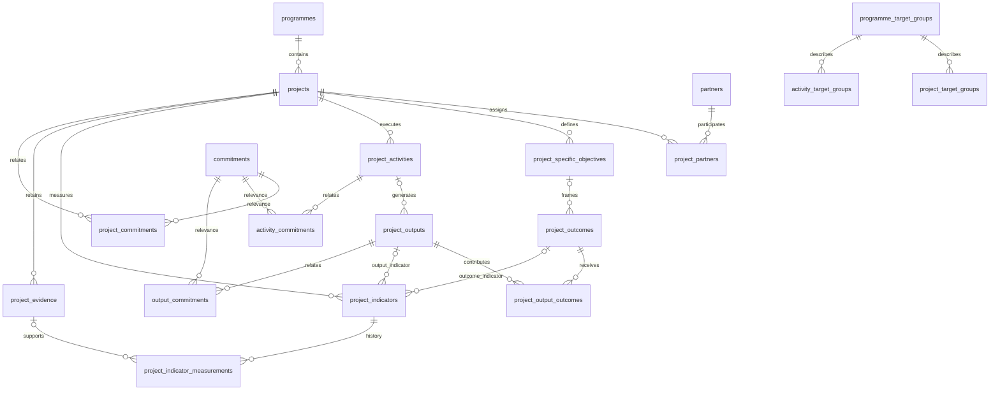

# Programmes & Projects — private cooperation and MEL layer

The public commitment chain (`Commitment → Expected actions → Indicators → Evidence → Assessment`) remains unchanged. The operational chain is `Programme → Country project → Partner → Activity → Output → Outcome → Project indicator → Project evidence`. Links express contribution or relevance, never State implementation or causal attribution. Completing activities, verifying project evidence and recording measurements do not write to HRCT assessments, evidence or public indicators.

## Integration

Next.js App Router, TypeScript and the existing Material UI design system. The module reuses `AdminFrame`, `AdminSection`, `Field`, `Choice`, `IndicatorAdminForm`, the existing signed admin session, `adminRest` and `adminRpc`. No new framework, UI library, auth provider, test runner or cloud service.

- `/admin/programmes`: operational overview with real record counts, upcoming/recent activities and project breakdowns.
- `/admin/programmes/{section}`: directories and filters. Main sections: `programmes`, `projects`, `partners`, `activities`, `results`, `indicators`, `evidence`.
- `/admin/programmes/{section}/new`: creation.
- `/admin/programmes/{section}/{uuid}`: editing, related records and private audit history. Measurements are read-only.
- `/admin/programmes/projects/{uuid}?tab=…`: `overview`, `framework`, `activities`, `indicators`, `partners`, `commitments`, `evidence`, `documents`, `edit`, `history`.
- Additional normalized relation editors: `assignments`, `objectives`, `output-outcomes`, `target-groups`, `project-groups`, `activity-groups`, `project-commitments`, `activity-commitments`, `output-commitments`, `measurements`.
- `/admin/recommendations/{publicId}`: reciprocal related Blue Human projects, activities and outputs. No operational data is added to public recommendation pages or site search.

## Data model

All operational entities and relation rows use UUIDs, `created_at`, `updated_at`, `created_by`, `updated_by`, and `archived_at`. Actors are identifiers of the existing environment-configured admin account, rather than invented Supabase Auth users. Manager/responsible-user fields accept stable internal account identifiers; they are not authorization claims. Future partner accounts must be mapped to explicit project memberships before granting access.

`project_specific_objectives` replaces free-form arrays of objectives. `project_output_outcomes` records N:M contributions. Activities have a generating relationship to outputs; outcomes may attach to a specific objective. `programme_target_groups`, `project_target_groups`, and `activity_target_groups` describe groups and aggregated populations, never individual beneficiaries. Countries accept ISO2 identifiers and names; Colombia is not hardcoded and the module does not depend on that country already existing in the public pilot catalogue.

Composite foreign keys enforce the same project for linked activities, objectives, outputs, outcomes, indicators, evidence and measurements. A responsible partner must already be assigned to that project. Referenced records use `ON DELETE RESTRICT`; the UI archives rather than deletes. Active commitment, target-group and output/outcome associations have partial unique indexes, allowing an archived relationship to be replaced without removing its historical row. Programme/project/activity codes remain reserved after archive.

## Permissions and audit

Every page, layout, server action and operational repository entry point checks `requireAdmin`. Data access uses `cache: no-store`. The service-role key remains server-only. All new tables enable RLS and explicitly revoke every privilege from `PUBLIC`, `anon` and `authenticated`; there are no public or authenticated policies. `service_role` receives only required privileges. The write RPC `hrct_programmes_write` is security-invoker and executable only by `service_role`, with a fixed table allowlist and protected metadata fields. The browser cannot submit arbitrary tables, columns or audit identities.

`public_visibility=false` is the default. A selection marks content as prepared for a later publication workflow; **this module exposes no public operational endpoints, views or files**, even when selected. Evidence selection requires both `confidentiality=public` and `verification_status=verified`. Confidentiality additionally distinguishes future partner, internal and restricted material. Contact details, budgets, funding, assumptions, risks and private notes remain in this admin-only domain.

Verification stamps the actual admin actor and date in the database. Editing verified evidence content invalidates verification and clears public selection. Visibility-only changes retain verification. `programme_audit` follows the existing private snapshot-audit pattern, adding the account actor. Its before/after snapshots retain project status, indicator definitions/targets, evidence verification and relation changes. Audit snapshots cannot be updated or deleted. Snapshots use JSON for historical records, not as a substitute for normalized operational relationships.

Measurements are append-only and cannot be edited, archived or deleted through the module. Corrections use `supersedes_id`, require the same indicator and measurement date, and prevent competing corrections of the same row. The unit and indicator type cannot change after a measurement exists. Future measurement dates, non-finite numbers and invalid dates are rejected. `current_value` and `last_updated_at` are derived from the latest non-superseded observation, ordered by measurement date, creation time and UUID. Back-entering older data does not displace newer observations. Blank is unavailable, while zero is a real observation.

Linear progress requires explicit `progress_method=linear`, a documented comparable unit, non-null baseline/current/target, and distinct baseline/target:

`(current - baseline) / (target - baseline) * 100`

It supports decreasing targets and preserves negative values and values above 100%. The default `none` displays contextual values without inventing percentages. No automatic “on track”, causal attribution or impact score is assigned.

## Operator workflow

1. Sign in through `/admin/login` and choose **Programmes → Programas → Crear programa**. Enter code, name, scope, manager and dates.
2. Choose **Proyectos → Crear proyecto**, select the programme, and enter the country, ISO2 code, project code, objectives, dates and internal funding details. The Colombia pilot can be entered with real approved information using this same form.
3. Create a partner, then open **Project → Partners** and create an assignment with its role and lead-partner designation. Record contacts only when operationally needed.
4. Open **Results Framework**. Add specific objectives, outcomes, outputs and explicit output/outcome contributions. Each linked row opens its editor; archive removes it from active lists while retaining history.
5. Open **Activities**, add the activity, assigned responsible partner, schedule, target-group description and aggregated participant counts. Add normalized target groups from the group's directories and associate them in project/ activity forms.
6. Open **Human Rights Commitments** to add project, activity or output relationships. Search the existing commitment selector by code/text and explain the contribution or relevance. The reciprocal relationship appears only on the administrative recommendation page.
7. Open **Evidence** or an activity's related evidence list. Enter source/date, optional private file reference or source URL, the related project records and confidentiality. New evidence is private and pending. Verifying stamps reviewer/date; selection for future publication is a separate explicit choice. Documents reuse this evidence vault instead of a second document system.
8. Create a **Project Indicator**, select the appropriate output/outcome (or process type), define unit, verification method and available baseline/target. Add dated measurements with a source and optional project evidence. To correct a measurement, enter its UUID in `supersedes_id`, keep the same date/indicator and explain the correction. Consult the full history and audit trail.

## Migration, checks and deployment

Versioned migrations: `supabase/migrations/20261008173400_programmes_mel.sql` and `supabase/migrations/20261008173727_programmes_fk_indexes.sql`, created with the Supabase CLI and aligned to the production migration-history version. Apply it through the established migration deployment process **before** deploying the frontend; the recommendation administration page reads the new relation tables. No production demo seed is included. All synthetic Colombia examples live exclusively in isolated test fixtures.

- `npm test`: existing tests plus migrated PGlite cooperation/permission/integrity tests and TypeScript model tests through Node's existing runner.
- `npm run test:programmes:ui`: isolated production Next.js build, PGlite-backed mock API and Playwright; tests actual forms, sessions, measurements, evidence confidentiality, project framework, reciprocal relationships and responsive rendering. No production `.env` or keys are copied.
- `npm run test:indicators:ui`: existing public tracker regression suite.
- `npm run indicators:validate`, `npx tsc --noEmit`, `npm run lint`, `npm run build`.

The lint script uses the already installed ESLint/Next configuration directly, replacing the unconfigured interactive `next lint` command. Existing unrelated lint warnings remain visible.

## Prepared future phases

Partner portal/membership authorization; carefully reviewed public projections and a publication approval workflow; private file upload/storage integration (currently source URLs and private file references); structured report exports; richer donor entities and account management. No donor portal, beneficiary CRM, accounting, payments, automatic PDF engine or AI impact claims. Programme scope, institutional project fields, dates, objectives, normalized relationships, measurement provenance and audit snapshots support subsequent country, partner, donor, annual and final reporting.

Production verification after applying both migrations: the commitment and assessment snapshots and all legacy row counts are unchanged; operational tables remain empty. Advisors report no uncovered foreign keys in the new module. RLS-without-policy information notices are intentional for admin-only tables. The two existing monitoring views retain their pre-existing [security-definer advisory](https://supabase.com/docs/guides/database/database-linter?lint=0010_security_definer_view), outside this change.
